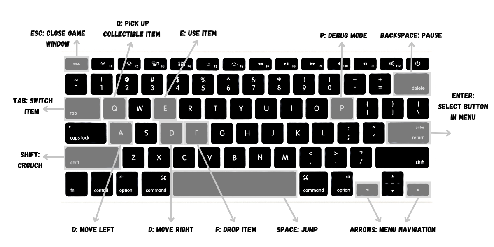
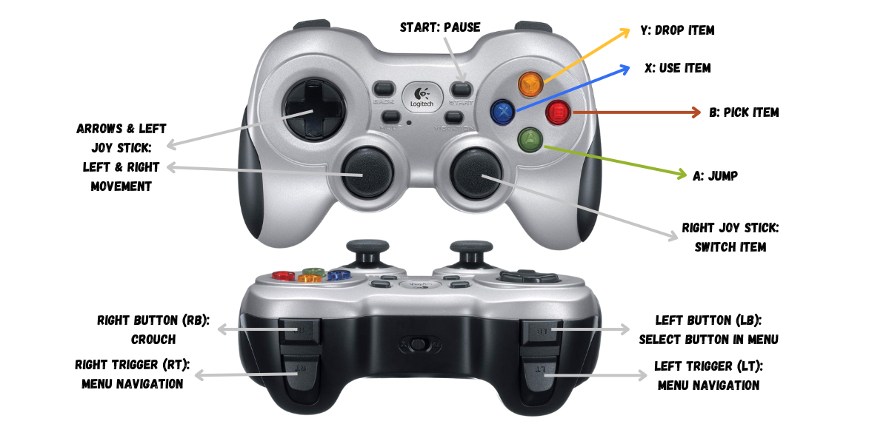

# Surviving Sarntal

## Project description

Surviving Sarntal is an action-packed arcade endless runner.
The player has to navigate a hiker through demanding terrain all whilst dodging dangerous rockfall.
Although the idea and a rough initial implementation of the game were devised in the Ferienakademie 2023, we rewrote the entire game from scratch in C++ using only a small number of libraries.
Goal of the project was the design of a finished game following good software engineering practice with particular focus on creating a performant physics engine for rigid body simulation.

## How to install and run

The project is compatible with Ubuntu 24.04.1 and also supports macOS. 
It includes several bash scripts to simplify installation, running, and testing. 
A platform-agnostic script handles installing dependencies across both operating systems. 
There are separate installation processes for playing the game and for development, with an additional script provided for developers. 

### Installation

In the event that only running the game is desired, the script `user\_setup.sh` can be used to facilitate the installation of the required packages and dependencies.
In that case, it is only necessary to run the following command from the root project directory:

```bash
$ source build-utils/user_setup.sh
```

The following packages will be installed based on the operating system.
The installation of the packages on MacOS requires the use of Homebrew.
If you do not have it installed you can still run the `user\_setup.sh` script, which will install it.

**Ubuntu:**
```bash
build-essential cmake xorg-dev libsdl2-dev
```
**MacOS:**
```bash
cmake sdl
```

### Running the Game
Once all of the dependencies have been installed, the script `run.sh` can be executed in order to run the game.
```bash
$ source build-utils/run.sh
```

## How to control the game

There are two options to control the game, either via keyboard or gamepad.

### Keyboard



### Gamepad



## The Game

The objective of the game is for the player to achieve the highest possible score (measured as the vertical and horizontal distance) by surviving for the longest possible duration while climbing the terrain.

The **hiker** is controlled by the user of the game and their health is indicated by a health bar.
If the hiker loses all their health points or falls behind the kill bar, the hiker dies and the game ends.
The hiker has different movement options, including moving to the left and right in the x-direction, jumping and crouching.

In the current version of the game, the **kill bar** is represented by a Yeti figure.
It is situated at the left edge of the screen and moves continuously while trying to catch the hiker.

There are **items** spawning during the course of the game which can be collected by the hiker:

- **Kaiserschmarrn**: Eating the delicious Kaiserschmarrn will restore the hiker's health.
- **Coin**: Collecting a coin increases the coin score and increases the speed of the hiker.
- **Duck**: The duck provides a shield for a few seconds. As long as the hiker has the shield, they won't take damage from being hit by rocks.
- **Rock bomb**: Using the rock bomb destroys all rocks that are currently in the air.

The items collected by the hiker are stored in an **inventory**.
The hiker can switch between the items in the inventory and select them for use.

New rocks are continuously generated and propelled through the air.
When the hiker is hit by a rock, the hiker's health decreases.

## Development

### How to develop

If you wish to take part in the development of the game, you will also need the following tools and libraries. Make sure you have installed the needed dependencies for running the game before continuing.

- clang-tidy 
- clang-format 
- git 
- pre-commit 
- python3 
- lcov


You can install the packages automatically using our `dev_setup.sh` script
```bash
$ source build-utils/dev_setup.sh
```

### Testing the Game

There are multiple options for testing the game at your disposal. To execute the unit tests without coverage, run

```bash
source build-utils/test.sh
```

Test coverage can be generated via
```bash
source build-utils/test_coverage.sh
```

To run with coverage, run

```bash
source build-utils/run_with_cov.sh
```

To get a combined coverage report, run

```bash
source build-utils/test_and_run_with_cov.sh
```

### Docs

To generate interactive code documentation using doxygen, run the script

```bash
source build-utils/generate_docs.sh
```

This will create a docs directory. 
Inside you will find a html and a latex version of the code documentation.
