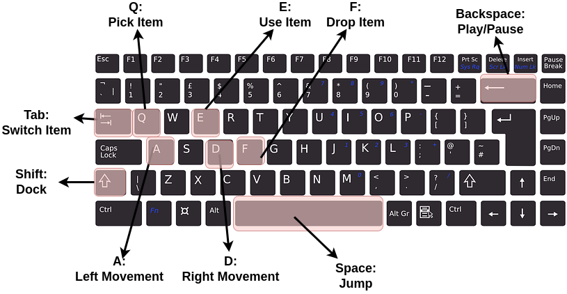
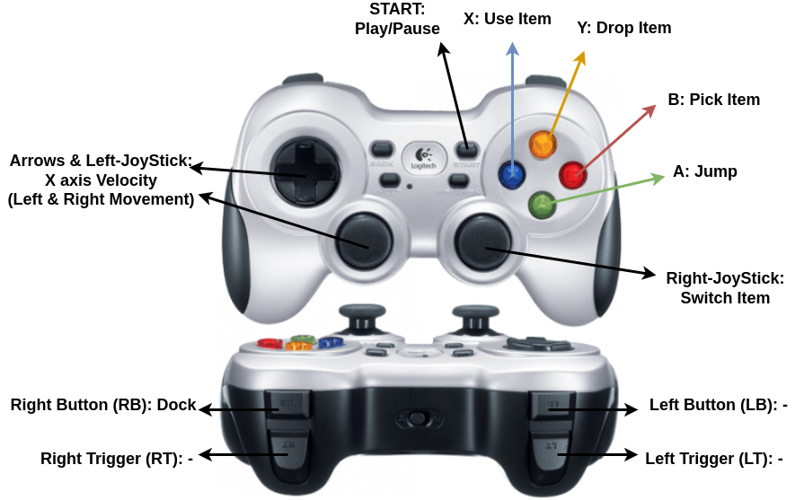

# Surviving Sarntal

## Project description
This is the game "Surviving Sarntal" students from Uni Stuttgart, FAU und TUM created in Ferienakademie 2023. The project is written in C++.

## How to install and run
In order to run the game do the following in the terminal. The game is developed for Linux and was also tested on Windows.

`cmake . -B cmake-build-debug`

`cd cmake-build-debug`

`make`

`./suviving_sarntal`

## The Game Logic

The goal of the game is to get the most amount of scores by surviving for a long time in sarntal. 
You can die by losing all your health points or if the hikers that follow from the left you catch up. 

From the right side rocks are falling down the mountain, which also bounce on the mountain. 
In a very physically correct way they bounce on the mountain.
You loose health points if you are hit by rocks. If the rock is bigger you lose more health points. 

There are also items that can help you:
- Kaiserschmarrn:  you gain health points after eating the delicious Kaiserschmarrn
- Duck: It makes a fun noise 
- Knife: It helps you avoid the falling rocks 
- Coin: Add points to the score

You can pick the items up, and they will be shown in the inventory. From there you can choose the item you want to use. 

## How to control the game

There are three options to control the game. Either via Keyboard, Gamepad or Kinect. 

### Keyboard

### Gamepad

### Kinect
To build the Kinect version of this game the following commands have to be executed:  

`cmake . -B cmake-build-debug-kinect -DKINECT=1`

`cd cmake-build-debug-kinect`

`make`

`./suviving_sarntal`

After executing the kinect supporting version of the game, the user has to do some movements, such that the kinect interface identifies him as the player.
Once there is a lock on the playing user, the ingame character movement to the right is initiated by stepping forward (to the right).
Stepping to the initial position prompts the ingame character to stop, stepping back is bound to moving backwards (to the left).
Jumping can be done by jumping in front of the kinect, ducking by crouching down. It is not possible to select between different items in the kinect mode, because the control would be too complicated.